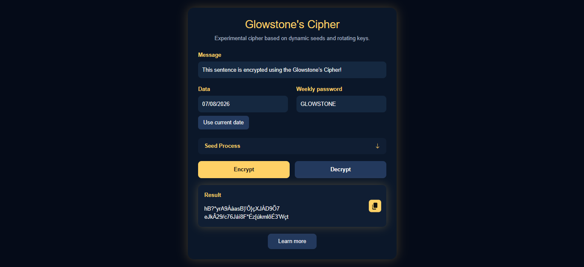
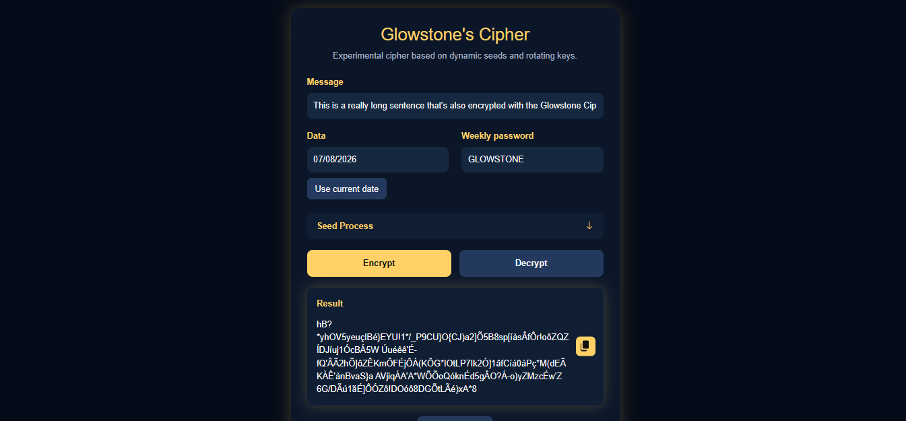

# Glowstone Cipher

> Experimental rotating-key and dynamic seed cipher inspired by the Enigma machine from World War II.

## About the Project

The **Glowstone Cipher** is an experimental cryptographic algorithm developed for educational and conceptual purposes.

The project uses a system of **dynamic seeds**, **rotating states**, and **modular mathematical operations** to create a cipher whose behavior changes according to the selected parameters.

Its goal is to recreate an experience similar to historical cryptographic systems, where a message depends not only on a shared key, but also on time-based configurations and predefined rules between operators.

🔗 **Online Demo:**  
https://glowstone91.github.io/glowstoneCipher/

> **Important:** This project should **not** be used to protect real-world information. It was created exclusively for learning, experimentation, and educational purposes.

---

# Demonstration

The Glowstone Cipher provides a web interface where you can generate seeds, encrypt messages, and decrypt them using the same parameters.

## Short Message

Example of a short sentence encrypted using the Glowstone Cipher.



---

## Long Message

The algorithm also supports larger texts while maintaining its dynamic rotating state throughout the encryption process.



---

# How the Cipher Works

The encryption system uses a custom set of **100 characters**, identified by indexes ranging from `0` to `99`.

The encryption process relies on:

- A date-generated seed.
- A password-generated seed.
- A dynamic multiplier.
- An internal state updated after every character.
- Modular arithmetic using modulo `100`.

---

# Character Set

The system recognizes exactly 100 characters.

## Uppercase Letters

```
A-Z
```

## Lowercase Letters

```
a-z
```

## Numbers

```
0-9
```

## Symbols

```
@$*!?-_/()[]{}
```

## Accented Characters

```
ÁÀÃÂáàãâÕÓÔõóôÉÊéêÍíÚúç
```

## Space

```
Index 99
```

Since the space character is also part of the character table, it is encrypted like every other character.

As a result, encrypted messages never contain visible spaces.

---

# Date Seed Generation

The selected date is transformed into a numerical seed.

Example:

```
06/08/2026
```

First, all non-numeric characters and zeros are removed:

```
[6,8,2,2,6]
```

Then, each digit is multiplied by the next one, with the last digit multiplying the first:

```
6 × 8 = 48
8 × 2 = 16
2 × 2 = 4
2 × 6 = 12
6 × 6 = 36
```

The original digits and multiplication results are then interleaved:

```
Date Seed

64881624212636
```

---

# Password Seed Generation

Each password character is converted into its index within the character table and then increased by `1`.

Example:

Password:

```
GLOWSTONE
```

Conversion:

```
G = 7
L = 12
O = 15
W = 23
S = 19
T = 20
O = 15
N = 14
E = 5
```

Result:

```
Password Seed

[7,12,15,23,19,20,15,14,5]
```

---

# Dynamic Multiplier

The multiplier controls the variation of the cipher's internal state.

It is calculated using:

- The current date.
- The password length.
- The binary representation of the password length.

Example:

Password:

```
GLOWSTONE
```

Character count:

```
9
```

Binary representation:

```
1001
```

Metrics:

Total number of bits:

```
D = 4
```

Bits equal to `1`:

```
U = 2
```

Factor:

```
F = D × U

F = 4 × 2

F = 8
```

Date sum:

```
Day + Month

06 + 08 = 14
```

Final multiplier:

```
((S + F) × 2) + 1

((14 + 8) × 2) + 1

= 45
```

The result is always an odd number, preventing certain mathematical patterns within modulo `100`.

---

# Final Seed

The Final Seed combines:

- The Date Seed.
- The Password Seed.

The combination is performed by adding both seeds element by element.

If one seed is shorter than the other, its values are repeated until the required length is reached.

---

# Rotating Encryption Process

For each character in the plaintext message:

## State Update

```
NewState =
(CurrentState × Multiplier + SeedKey) mod 100
```

## Character Encryption

```
EncryptedCharacter =
(OriginalPosition + NewState) mod 100
```

The internal state changes after every encrypted character, meaning every position in the message uses a different shift value.

---

# Technologies Used

- **HTML5**
  - Application structure.

- **CSS3**
  - User interface and styling.

- **JavaScript (ES6+)**
  - Encryption algorithm implementation.

- **Bootstrap 5**
  - Responsive UI components.

- **Bootstrap Icons**
  - Interface icons and visual elements.

---

# Fictional Lore and Background

The Glowstone Cipher was designed around a fictional tactical communication scenario inspired by historical encryption systems such as the Enigma machine.

Although the encryption algorithm itself is entirely original, its setting recreates the idea of operators exchanging encrypted messages using shared rules and secret parameters.

## The Zero Point

Before an operation begins, every operator agrees on a secret starting date.

Example:

```
09/02/1378
```

Each new day, every operator advances this date by one day, automatically changing the cipher parameters.

---

## The Secret Book

Every operator carries the same physical book, which serves as the source for generating the password.

The password may be obtained through previously agreed rules, such as:

- Extracting proper names from a specific chapter.
- Selecting words in a predefined order.
- Applying a custom extraction method known only by the operators.

Since the password is never transmitted directly, only those who possess the book and understand the extraction method can reproduce it.

---

## Decoy Objects

To avoid drawing attention to the book if multiple agents carry the same edition, every operator also carries unusual objects.

Examples include:

- A clock without hands.
- An engraved stone.
- A pair of mismatched socks.

These items exist solely as decoys, distracting investigators from the real object of interest: the book.

---

## Inspiration from Enigma

Just as the Enigma machine relied on daily shared configurations, the Glowstone Cipher changes its behavior whenever its parameters change.

Each new day represents a completely new configuration of the system, requiring every operator to use the exact same parameters to maintain communication.

---

# Security Disclaimer

The Glowstone Cipher is an **experimental** cryptographic project.

It has **not** undergone professional cryptanalysis and may contain:

- Statistical patterns.
- Mathematical weaknesses.
- Undiscovered vulnerabilities.

**Do not use this cipher to protect:**

- Real passwords.
- Financial information.
- Personal or confidential data.
- Production systems.

This project was created exclusively for educational purposes, experimentation, and the study of cryptographic concepts.

---

# License

This project is licensed under the **MIT License**.

You are free to study, modify, and adapt the source code for your own experiments.

---

# Intercepted Transmission

An encrypted transmission generated using the **Glowstone Cipher** is available in this repository.

The document contains a fully encrypted version of this English README and serves as a practical demonstration of the algorithm.

**Can you decrypt it?**

🔐 **Access the intercepted document:**

➡️ **[README_INTERCEPTED_ENCRYPTED.md](README_INTERCEPTED_ENCRYPTED.md)**
